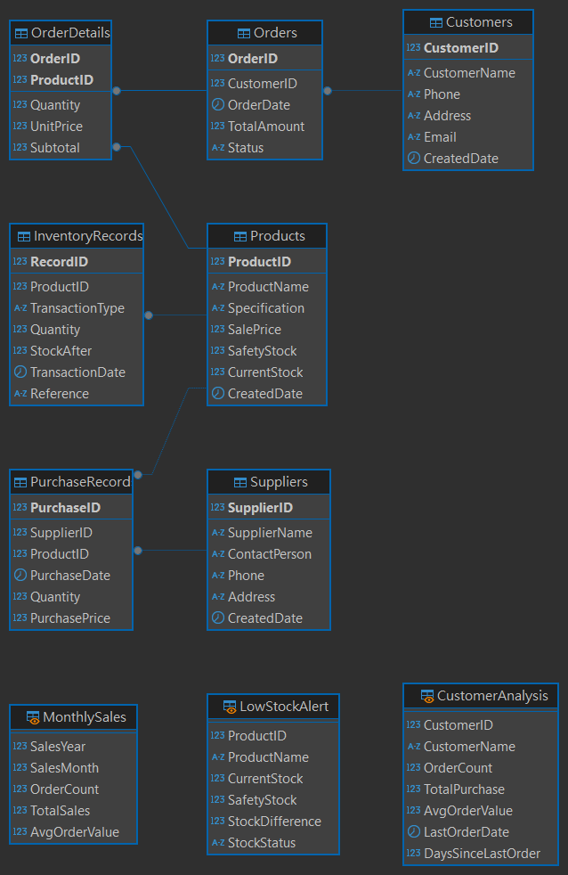

# 訂單庫存管理系統 (Order Inventory Management System)

這是一個基於 SQL 的訂單庫存管理系統，用於管理產品、訂單和庫存。

## 專案結構

專案包含以下主要 SQL 文件：

- `CreateTable.sql`: 創建資料庫表結構
- `InsertData.sql`: 插入初始測試數據
- `View.sql`: 創建資料庫視圖
- `Index.sql`: 創建資料庫索引
- `Delimiter.sql`: 存儲過程和觸發器
- `SelectTest.sql`: 查詢測試
- `FuntionTest.sql`: 函數測試

## 系統功能

- 產品管理
- 訂單處理
- 庫存追蹤
- 數據分析視圖
- 自動化觸發器

## 技術細節

- 使用標準 SQL 語法
- 包含存儲過程和觸發器
- 實現了資料庫視圖
- 建立了適當的索引以優化查詢性能

## 使用說明

1. 首先執行 `CreateTable.sql` 創建資料庫結構
2. 執行 `InsertData.sql` 插入測試數據
3. 根據需要執行其他 SQL 文件

## 系統架構圖

## 注意事項

- 執行 SQL 文件時請注意順序
- 建議在測試環境中先進行測試
- 請確保有適當的資料庫備份